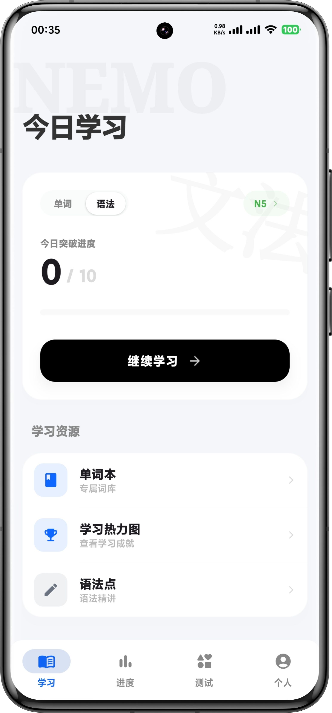
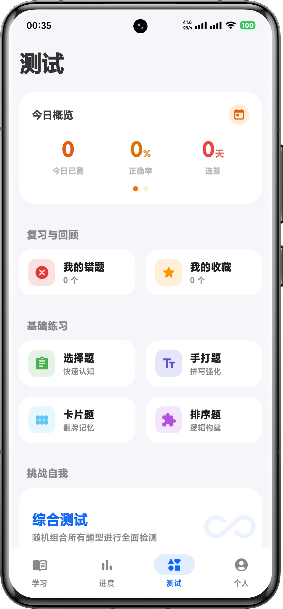
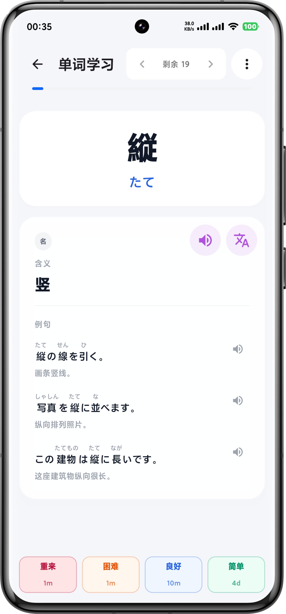
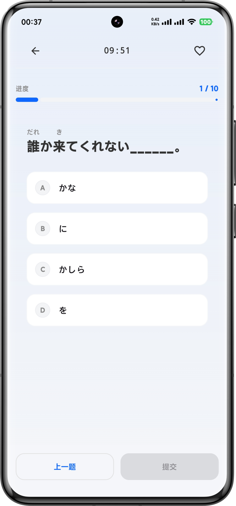
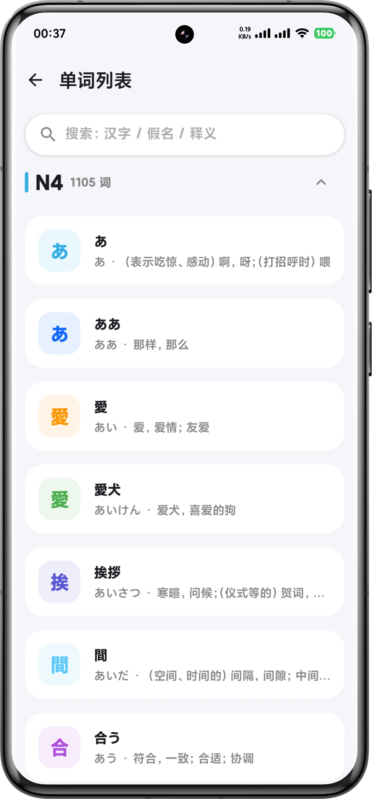
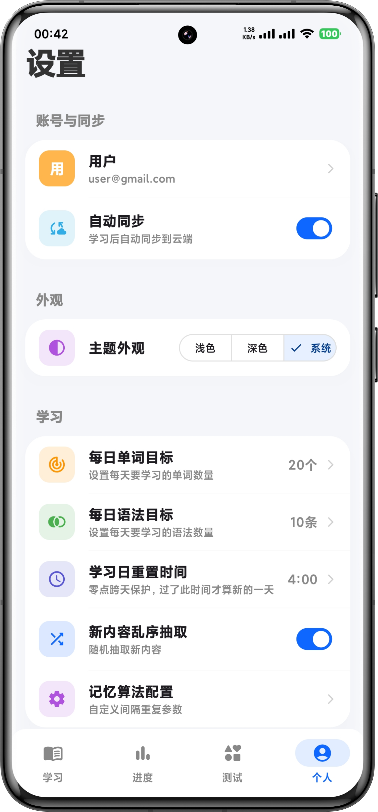
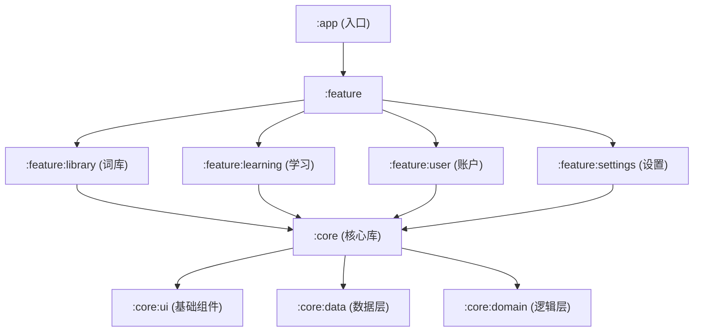

# 🌊 Nemo

<p align="center">
  <strong>一款由 AI 驱动、基于现代 Android 技术栈构建的灵动日语词法学习应用</strong>
</p>

<p align="center">
  
  
  
  
  
</p>

---

## 📖 目录
- [✨ 项目简介](#-项目简介)
- [🖼️ 预览展示](#-预览展示)
- [🚀 核心特性](#-核心特性)
- [🛠️ 技术栈](#-技术栈)
- [📂 模块结构](#-模块结构)
- [⚙️ 快速开始](#-快速开始)
- [🧠 学习算法高级设置](#-学习算法高级设置)
- [🤖 纯 AI 创作声明](#-纯-ai-创作声明)
- [📄 开源协议](#-开源协议)

---

## ✨ 项目简介

**Nemo** 是一款专为日语学习者设计的灵动词汇应用。它不仅提供了优雅的交互体验，更结合了日语学习的特点，通过沉浸式的设计和云端同步功能，助你高效攻克日语词汇难关。

> [!TIP]
> **灵动日语，即刻同步** —— Nemo 致力于在简洁与功能之间找到完美平衡。

## 🖼️ 预览展示

> [!TIP]
> **多维视角，灵动交互** —— 通过以下截图快速了解 Nemo 的核心交互界面。

| | | |
| :---: | :---: | :---: |
|  |  |  |
|  |  |  |

---

## 🚀 核心特性

- 🇯🇵 **日语专属优化**：针对平假名、片假名、汉字词汇学习深度定制，支持全方位的假名检索。
- 📚 **灵动词库系统**：卡片式管理，支持多维度分类、关键词搜索与快速预览。
- 🧠 **AI 算法助学**：内置针对日语记忆曲线设计的复习算法，动态调整复习重点。
- 📊 **可视化统计**：多维图表展示学习进度，清晰观测掌握程度。
- ☁️ **云端数据中心**：基于 Supabase 构建，全平台登录即同步，数据安全无忧。
- 🎨 **前沿视觉交互**：全面采用 Jetpack Compose 的 Material 3 设计语言，交互灵动，支持原生深色模式。

---

## 🛠️ 技术栈

| 领域 | 技术选型 | 理由 / 说明 |
| :--- | :--- | :--- |
| **语言** | Kotlin 1.9+ | 现代、安全且 100% 互操作的 Android 标准语言 |
| **UI 框架** | Jetpack Compose | 纯声明式 UI，实现高度复用与灵动动画 |
| **架构系统** | 模块化 + MVI | 解耦逻辑，提升可维护性，确保一致的状态流转 |
| **网络层** | Ktor / Supabase SDK | 轻量化、高效率，完美适配 Kotlin 协程 |
| **持久化** | Room + Cloud DB | 本地缓存加速响应，云端数据永久保障 |
| **依赖注入** | Hilt (Dagger) | 标准化的 DI 实现，降低组件耦合度 |
| **异步流** | Coroutines & Flow | 优雅处理并发与响应式数据更新 |

---

## 📂 模块结构

项目采用分层模块化架构，各个功能高度独立：



---

## ⚙️ 快速开始

### 1. 配置云端环境
1. 在 [Supabase](https://supabase.com/) 创建新项目。
2. 在 `Settings -> API` 中寻找 `URL` 和 `anon key`。

### 2. 初始化本地配置
在根目录 `local.properties` 添加：
```properties
SUPABASE_URL=你的项目URL
SUPABASE_ANON_KEY=你的项目ANON_KEY
```

### 3. 编译运行
使用 Android Studio 直接打开并 Build 即可。

---

## 🧠 学习算法高级设置

在 App 内进入「设置 -> 学习 -> 记忆算法配置」，可调整以下参数：

| 参数 | 作用 | 默认值 | 推荐值（大多数用户） |
| :--- | :--- | :--- | :--- |
| 学习阶段 (Learning Steps) | 新卡学习步进（分钟） | `1 10` | `1 10` |
| 重学阶段 (Relearning Steps) | 复习失败后的重学步进（分钟） | `1 10` | `1 10` |
| 提前复习阈值 (Learn Ahead Limit) | 允许提前复习的时间窗口 | `20` 分钟 | `10~25` 分钟 |
| Leech 阈值 | 累计失败达到该次数触发 Leech | `5` 次 | `4~6` 次 |
| Leech 行为 | Leech 触发后的处理策略 | `skip` | 新手建议 `bury_today`，进阶建议 `skip` |

### Leech 行为说明

- `skip`：命中后卡片被暂停，不再进入常规复习队列，适合希望主动清理“钉子户”卡片的用户。
- `bury_today`：命中后仅埋到次日，今天不再出现，明天自动回到队列，适合希望“温和降压”的用户。

### 推荐调参策略

1. 初次使用保持默认值，先学习 7 天再调整。
2. 若当天复习压力过大，优先将 Leech 行为改为 `bury_today`。
3. 若错题长期反复，保持 `skip`，并把 Leech 阈值调低到 `4`。
4. 若等待时间过长影响节奏，可将提前复习阈值提高到 `25` 分钟左右。

> [!TIP]
> 为保证稳定性，每次只改 1 个参数，并至少观察 3 天效果再做下一次调整。

---

## 🤖 纯 AI 创作声明

> [!IMPORTANT]
> **这是一个几乎完全由 AI 驱动生成的实验性项目。**
> 从最初的构思、架构选型、核心逻辑编写到目前的 UI 迭代与文档说明，均由 AI 与开发者协作完成。本项目旨在证明 AI 协同在复杂 Android 移动开发中的工程化落地能力。

---

## 📄 开源协议

本项目遵循 [MIT License](LICENSE) 协议。
